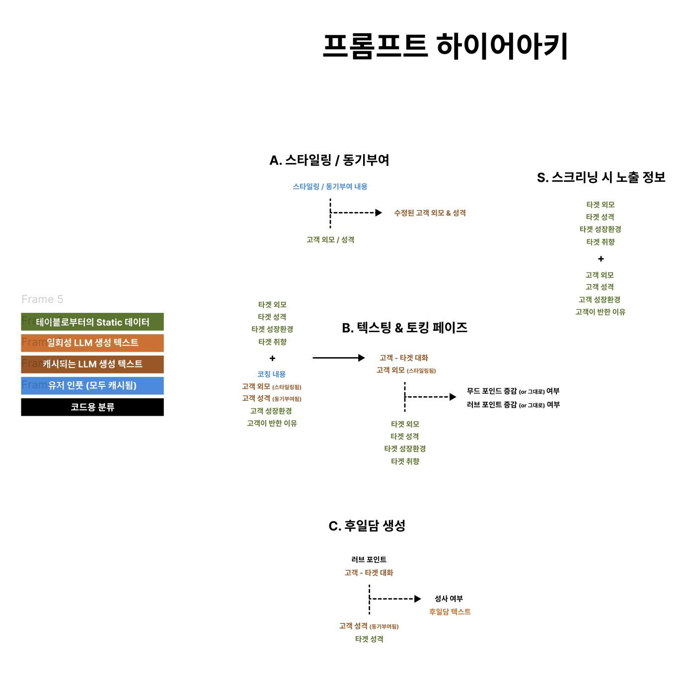

# 💘 연애조작단 2077: 오퍼레이션 큐피드

> 2077년, 출산율 0.008. 테크노킹 도람푸 3세의 특명으로 창설된 비밀기관 **큐피드局**의
> 공작요원이 되어, **도저히 이어질 리 없는 두 사람**을 기어이 이어붙여라.

three.js + LLM API로 만든 **B급 병맛 LLM 게임**. 서버 없음, 빌드 없음, GitHub Pages에서 그대로 돌아간다.
키는 **Anthropic · OpenAI · OpenRouter** 셋 다 받는다. 업자를 고르는 화면은 없다 — 키를 보고 알아서 판별한다.

---

## 📐 이 게임의 설계도

이 저장소는 **한 장의 구조도**를 그대로 구현한 것이다. 그 그림에 없는 것은 게임에 없다.



### 범례 — 색이 곧 데이터의 출처다

| 색 | 뜻 | 예 |
|---|---|---|
| 🟩 **static** | 테이블로부터의 Static 데이터 | 타겟 외모·성격·성장환경·취향 / 고객 성장환경·반한 이유 |
| 🟦 **user** | 유저 인풋 (모두 캐시됨) | 스타일링 · 동기부여 · 코칭 |
| 🟫 **cached** | 캐시되는 LLM 생성 텍스트 | 수정된 고객 외모 & 성격 |
| 🟧 **once** | 일회성 LLM 생성 텍스트 | 고객 - 타겟 대화 · 후일담 텍스트 |
| ⬛ **code** | 코드용 분류 | 무드 포인트 · 러브 포인트 · 성사 여부 |

화면도 같은 색을 쓴다(`css/style.css`의 `--tone-*`). 어느 화면에서든 파란 칩은 「당신이 쓴 것」,
갈색 칩은 「캐시된 LLM 산출물」이다.

### 블록은 넷뿐이다

`A`는 상자 하나지만 **호출은 둘**이다. 상자가 직접 그어놓은 선(스타일링→외모, 동기부여→성격)에서
그대로 자른 것이라 흘러가는 데이터는 그림과 같다. 미용실은 성격을 못 보고, 취조실은 외모를 못 본다.

```
A-1. 미용실 — 스타일링
     [user]   스타일링 내용
   + [static] 고객 외모
   → [cached] 수정된 고객 외모   (+ 3D 조형)

A-2. 취조실 — 동기부여
     [user]   동기부여 내용
   + [static] 고객 성격
   → [cached] 수정된 고객 성격

S. 스크리닝 시 노출 정보              (프롬프트가 아니라 화면)
     [static] 타겟 외모 · 성격 · 성장환경 · 취향
   + [static] 고객 외모 · 성격 · 성장환경 · 반한 이유

B-1. 텍스팅 & 토킹 — 대화 생성
     [static] 타겟 외모 · 성격 · 성장환경 · 취향
   + [user]   코칭 내용
   + [cached] 고객 외모(스타일링됨) · 고객 성격(동기부여됨)
   + [static] 고객 성장환경 · 고객이 반한 이유
   → [once]   고객 - 타겟 대화

B-2. 텍스팅 & 토킹 — 판정
     [once]   고객 - 타겟 대화
   + [cached] 고객 외모(스타일링됨)
   + [static] 타겟 외모 · 성격 · 성장환경 · 취향
   → [code]   무드 포인트 증감 여부 · 러브 포인트 증감 여부

C. 후일담 생성
     [code]   러브 포인트
   + [once]   고객 - 타겟 대화
   + [cached] 고객 성격(동기부여됨)
   + [static] 타겟 성격
   → [code]   성사 여부      + [once] 후일담 텍스트
```

**이 표가 곧 회귀 테스트다.** `tests/orders.test.mjs`는 필드마다 표식을 심어 네 프롬프트를 만들고,
그 표식이 들어가야 할 곳에 들어갔는지 · **들어가면 안 되는 곳에 안 들어갔는지**를 전수로 확인한다.
`npm run audit`은 같은 규칙이 코드에 살아 있는지를 본다.

### 그리고 데이터가 아닌 것 하나 — R. 반응

```
R. 준비 단계 반응                      (구조도 밖. 데이터가 아니라 소리다)
     [user]   방금 내린 주문 하나 (스타일링 / 동기부여 / 코칭 중 하나)
   + [static] 고객 외모 · 성격 · 성장환경   ← 테이블 값. 시공되기 **전**의 것이다
   → [once]   그 자리에서 고객 입에서 나온 한두 마디
```

요원이 주문을 하나 내릴 때마다 고객이 대꾸한다 — *"정말 이걸 하라고요?"* 쪽이든, 잠자코
받아들이든. **이 문장은 화면에 뜨고 거기서 끝난다.** 대화도 판정도 후일담도 이걸 보지 못하고,
점수에도 닿지 않는다. 그래서 하이어아키를 건드리지 않는다 — 위 네 블록의 입력은 하나도 안 바뀐다.
`tests/orders.test.mjs`가 이것도 전수로 지킨다 (타겟을 못 본다 · 시공된 시트를 못 본다 ·
다른 방의 주문을 못 본다).

### 지시는 영어, 출력은 한국어

프롬프트의 **지시문은 전부 영어**다. 한국어는 셋뿐이다 — 테이블에서 온 인물 데이터,
화면에 그대로 뜨는 라벨, 한국어로 나와야 하는 출력의 예시. ASCII로만 된 가상 인물로 다섯
프롬프트를 지어 **한글이 한 글자라도 남으면 테스트가 깨진다.**

---

## 🎮 플레이 방법

1. **부팅** — 요원명 + API 키. Anthropic(`sk-ant-...`) · OpenAI(`sk-...`) · OpenRouter(`sk-or-...`) 아무거나.
   **키가 없으면 게임이 아예 안 돈다.** 요원명은 서식 인쇄용이고 연산에는 넘어가지 않는다.
2. **신입 교육 슬라이드 5장** — 구조도 한 칸씩.
3. **S · 스크리닝** — 상설 의뢰 47건. 각 건에 대해 **여덟 항목이 전부 열린다.**
4. **A-1 · 미용실** — 한 문장으로 고객의 **외모**를 통째로 덮어쓴다. 3D 아바타가 그 자리에서 바뀐다.
5. **A-2 · 취조실** — 형광등 하나, 의자 하나. 고객의 **성격**을 통째로 덮어쓴다. 외모는 여기서 안 건드린다.
6. **B · 코칭 하달** — 대화에서 뭘 하고 뭘 하지 말지, **고객에게만** 들어가는 명령 한 덩이.
   대화 장면 자체가 아니다 — 대화는 다음 단계에서 생성된다.
7. **B · 텍스팅 4구간 → 토킹 5구간** — 대화가 굴러가고, 매 구간 무드·러브가 오르내린다.
8. **C · 후일담** — 성사 여부와 후일담.

준비 세 화면은 주문을 받을 때마다 고객의 반응을 한 줄씩 받아온다. 채점이 아니라 **소리**다.

---

## 🧨 이 게임의 규칙 세 개

### ① 요원이 쓴 글은 채점되지 않는다

손댈 수 있는 건 셋뿐이다 — **스타일링 · 동기부여 · 코칭.** 셋 다 점수가 없다.
시험이 아니라 **프롬프팅**이다. 당신이 쓴 문장은 프롬프트에 **그대로 주입**되고,
점수는 오직 **"그래서 그 두 사람이 실제로 뭐라고 말했는가"** 로만 매겨진다.

| 레버 | 채점? | 실제로 하는 일 |
|---|---|---|
| ✂️ **스타일링** (미용실) | ❌ | 고객 **외모** 시트를 통째로 다시 쓴다. 3D 아바타도 같이 바뀐다 |
| 🔥 **동기부여** (취조실) | ❌ | 고객 **성격** 시트를 통째로 다시 쓴다. 어떤 인간으로 그 자리에 앉을지가 여기서 정해진다 |
| 🎧 **코칭** (코칭실) | ❌ | 대화 프롬프트의 고객 쪽에 **명령**으로 박힌다. 비우면 고객은 준비 없이 제 시트대로만 움직인다 |

심판은 **코칭을 못 본다.** 지시문이 보이면 심판은 두 사람이 실제로 한 말 대신 지시의 영리함을
채점하게 된다. 심판이 받는 고객 쪽 정보는 **스타일링된 외모 한 줄**뿐이다 — 타겟의 눈에 실제로
보이는 것이 그것뿐이기 때문이다.

### ② 감춰둔 항목은 없다

여덟 항목이 스크리닝에서 전부 열린다. 미공개 성향도, 지뢰도, 대화 중에 새로 드러나는 것도 없다.
**대신 그 여덟 항목이 그대로 대화 프롬프트에 실린다.** 요원이 읽은 것이 곧 게임이 읽는 것이다.

경계는 딱 하나 남아 있다 — **타겟 취향은 요원 화면에만 떠 있고, 고객은 모른다.**
노리게 하려면 코칭에 직접 적어야 한다. 그게 이 게임에서 코칭이 존재하는 이유다.

### ③ 심판이 내보내는 것은 증감 여부뿐이다

```json
{ "mood": "up" | "down" | "same", "love": "up" | "down" | "same" }
```

점수도, 등급도, 해설도, 이유도 없다. **방향만 고르고 폭은 코드가 정한다**(`js/points.js`).
스칼라를 맡기면 LLM은 전부 +4~+6에 몰아넣고, 해설을 맡기면 해설을 잘 쓰려고 판정을 왜곡한다.

**눈금은 셀 수 있는 크기다.** 한 걸음이 1이고 최대치가 10과 12라, 화면의 숫자가 곧
「몇 번 움직였나」다. 0~100을 쓰던 시절에는 50에서 12씩 움직여 놓고 백분율인 척했다.

| 게이지 | 하는 일 | 눈금 | 시작 | 한 걸음 |
|---|---|---|---|---|
| 🌡 **무드 포인트** | 이 자리가 굴러가는가. **0이 되면 그 자리는 거기서 끝난다** (남은 구간을 안 돈다) | 0–12 | 8 | **언제나 ±1** |
| 💗 **러브 포인트** | 타겟이 고객을 원하게 됐는가. **후일담이 읽는 유일한 숫자다** | 0–12 | 2 | ▼ −1 / **▲ +1~+4** |

**무드는 한가운데가 아니라 그 위(8/12)에서 시작한다** — 자리는 처음엔 견딜 만하고
방치하면 식는다. 이것도 실측으로 잡았다. 5/10일 때는 판정이 ▼로 기울어 성의껏 코칭한
판마저 43%가 중간에 깨졌고, 달아오름 밴드(≥8) 체류가 1%라 위 규칙 ①이 사실상 죽어
있었다. 8/12로 올리니 코칭 판 파탄이 5%로 내려가 아홉 구간을 다 돌고 밴드 체류가
23%로 살아난다. **아무것도 안 한 판은 여전히 34%가 깨지고 성사는 0.3%다.**

러브 최대치 12는 **실측으로 잡았다**(`tests/calibrate.mjs`). 후일담이 성사를 찍는 문턱이
환산 50~70 사이인데, 최대치가 20이면 9구간을 다 돌아도 환산 평균이 26에 그쳐 성사가
4.6%밖에 안 났다. 12로 줄이면 같은 판정 분포에서 환산 43 · 성사 20%가 된다.

험악한데 끌리는 판(무드 ▼ / 러브 ▲)도, 화기애애한데 아무것도 안 움직인 판(무드 ▲ / 러브 ─)도
그대로 성립한다. 프롬프트에 「따로 읽어라」가 못박혀 있고, 회귀 테스트가 그걸 지킨다.

### 러브 ▲의 폭을 정하는 규칙은 둘뿐이다

심판은 여전히 **방향만** 고른다. 그 ▲가 몇 칸짜리인지는 코드가 정하고, 규칙은 이 둘이 전부다.

```
러브 ▲ = 1  +  (무드 ≥ 8 이면 +1)  +  (2연속 +1 · 3연속 이상 +2)      → 1~4칸
러브 ▼ = −1  (언제나. 자리가 뜨겁든 얼었든 밟힌 건 밟힌 것이다)
무드   = ±1  (언제나. 사정을 안 탄다)
```

① **자리가 달아올라 있으면 한 칸 더** — 같은 한 마디도 뜨거운 자리에서 더 깊게 박힌다.
무드가 러브에 얹는 것은 이 한 칸뿐이고, **깎지는 않는다.** 얼어붙은 자리에서 꽂힌 ▲도
1칸을 그대로 받는다 — 험악한데 끌리는 판을 벌주지 않기 위해서다.

② **연달아 꽂히면 커진다** — 한 번은 우연일 수 있지만 세 번은 사람이 넘어가는 중이다.
▼나 ─ 가 하나만 껴도 연속은 끊긴다.

그래서 **같은 ▲ 3개가 같은 점수가 아니다:**

| 같은 ▲ 3개 | 러브 | 환산 |
|---|---|---|
| 산발 · 미지근한 자리 | 5 / 12 | 42% |
| **연속** · 미지근한 자리 | 8 / 12 | 67% |
| **연속 · 달아오른 자리** | 11 / 12 | 92% |

언제, 어디서, 연달아 꽂혔는지가 점수가 된다. (이전 규칙에서는 셋 다 똑같이 36점이었다.)

**후일담에 넘길 때만 0~100으로 되돌린다.** C의 프롬프트는 「0이면 하루 종일 아무것도 안
움직인 것, 100이면 이미 연인」이라는 *의미의* 눈금을 쓴다. 안쪽 눈금을 압축한 뒤에도 그
문장이 그대로 맞도록 `loveOutOf100()`이 넘기는 순간에만 환산한다 — **프롬프트는 한 글자도
안 바뀌었고, 심판은 무드도 러브도 여전히 못 본다.**

**러브의 기준선은 `same`이다.** 회사원은 하루에 열두 번 유쾌하고 다정한 대화를 하고
그중 아무하고도 사랑에 빠지지 않는다. 대화가 잘 굴러간 것에는 한 점도 주지 않는다.

---

## 🗃 인물 데이터

```js
{
  id, category,
  client: { name, gender, look[], personality[], upbringing[], fell,   spec },
  target: { name, gender, look[], personality[], upbringing[], taste[], spec },
}
```

- **`upbringing`** — 성장환경. 첫 줄이 나이·직업, 나머지가 살아온 자리.
- **`fell`** — 고객이 반한 이유. 둘이 어떻게 얽혔고, 무엇에 반했고, 사귀면 뭐가 망가지는지가 여기 다 들어 있다.
  **고객에게만 있다.** 반한 쪽은 고객이다.
- **`taste`** — 타겟 취향. **평평한 문자열 목록**이다. 공개/미공개 플래그도, 지뢰도 없다.
  **타겟에게만 있다.** 공략당하는 쪽이 타겟이다.
- **`spec`** — 3D 조형. 정보가 아니라 렌더링이다.

`js/couples.js`는 로드되는 순간 스키마 밖 필드가 있으면 죽는다.
`tests/couples.test.mjs`가 47건 전수로 같은 것을 본다.

---

## 🧱 파일

| 파일 | 하는 일 |
|---|---|
| `js/prompts.js` | **카트리지.** 다섯 호출(A-1·A-2·B-1·B-2·C) + 반응의 프롬프트와 스키마 전부. 여기 없는 프롬프트는 없다 |
| `js/points.js` | 코드가 들고 있는 수치 전부. 무드·러브 눈금, 러브 ▲의 폭을 정하는 규칙 둘, 페이즈. LLM 없이 단독 테스트된다 |
| `js/engine.js` | 하네스. B를 구간마다 돌리고 C를 부른다. **DOM을 모른다** |
| `js/couples.js` | 상설 의뢰 47건 + 스키마 검증 |
| `js/game.js` | 화면·입력. 구조도의 칸들을 그대로 화면으로 옮긴 것 (미용실·취조실·코칭 포함) |
| `js/llm.js` | API 클라이언트. 업자 판별 · 캐시 breakpoint · 재시도 · 구조화 출력 · 사용량 집계 |
| `js/avatar.js` | three.js 블록 아바타. 스펙(JSON)으로 조립한다 |
| `js/pacing.js` | 대화를 사람이 읽는 속도로 붙잡아 두는 층 |
| `js/audio.js` | 효과음 |

### 호출 구조

판 하나에 **구간당 2콜 + A-1·A-2 2콜 + C 1콜 + 반응 3콜 = 24콜 내외**다.
준비 단계의 5콜(A-1·A-2·반응 3)은 전부 짧고 서로 독립이라 캐시가 붙지 않는다.
같은 화면의 반응과 시공은 **나란히 날아간다** — 서로의 입력을 안 받으므로 기다릴 이유가 없다.

- **생성(B-1)의 system은 판 내내 바이트 동일하다.** 캐시 breakpoint가 붙고, 구간이 쌓일수록
  접두사가 그대로 재사용된다. 대화 내역은 `messages`에 평문으로 쌓여 다음 구간의 접두사가 된다.
- **판정(B-2)의 system도 판 내내 동일하다.** 구간 본문만 갈린다.
- 판정 호출은 **띄워놓고 말풍선을 먼저 흘린다.** 읽는 동안 뒤에서 날아온다.

---

## 🧪 검사

```bash
npm test        # 규칙 전량 (113항목) — 수치 · 데이터 · 스키마 · 하네스 · 하이어아키 감사
npm run audit   # 구조도가 코드에 아직 살아 있는가 (「폐지된 것」 절이 핵심이다)
npm run browser # 실제 브라우저 E2E — three.js·썸네일 94개·다섯 화면·두 게이지·후일담
npm run responsive  # 9개 뷰포트 × 9개 화면 — 레이아웃 이탈 · 터치 타깃 · 명암비 AA
npm run live    # 실제 API로 판을 돌려 러브/무드 분포를 본다 (크레딧 소모)
npm run calibrate  # 밸런싱 하네스 — 대화 코퍼스 1회 생성 후 판정을 반복 재생한다 (크레딧 소모)
npm run serve   # http://localhost:8000
```

`npm run browser`는 기본이 **가짜 LLM 모드**다. DOM·CSS·three.js·게임 흐름은 전부 진짜로 돌고
LLM만 결정적으로 대체된다. 키도 크레딧도 필요 없다. `--live`를 주면 실제 API로 간다.

`npm run live`가 보는 것은 **`none`(아무것도 안 쓴 판)과 `ace`(LLM 요원이 쓴 판)가 갈리는가**다.
러브 ▲ 비율이 20~35%면 건강하고, 60%를 넘으면 심판이 판정을 하는 게 아니라 도장을 찍고 있는 것이다.

---

## 🗑 폐지된 것

이전 버전에는 축이 훨씬 많았다. 구조도에 없는 것을 전부 걷어냈고, `npm run audit`이
**되살아나는 것을 막는다** (주석은 안 본다 — 기록은 남길 수 있다).

| 폐지 | 무엇이었나 |
|---|---|
| 지뢰(`neg`) · 미공개 성향(`open`) | 상대 성향을 공개/미공개/지뢰로 쪼개던 것. 지금은 `taste` 한 목록 |
| 새로 드러난 것(`revealed`) · 비밀 집계 | 대화 중 밝혀진 것을 심판이 서술하고 집계하던 것 |
| 공기(`vibe`) | 심판이 매 합 갱신해 두 인물에게 전달하던 텍스트 분위기. 무드 포인트가 그 자리를 이어받았다 |
| 무전 개입 | 대화 중 고객에게만 들리는 명령. 배급 3회 |
| 합(bout) · `carry` · 첫인상 판정 | 채점 단위를 심판이 잘라 나누던 것 |
| 등급(tier) · 호감 포화 · 손실 완충 · 반복 감쇠 | 점수 밴드와 보정 계수 전부 |
| 강압(leverage) · 사망(casualty) · 자리이탈(walkout) | 대화가 사람을 묶거나 죽이거나 끝내던 판정 |
| 난이도 · 성공선 · 공작 등급 | 쉬움/보통/헬과 호감 문턱. **성사 여부는 이제 C가 정한다** |
| 어긋남(`wreck`) · 상대관심 · 공기읽기 · 명령수용 | 인물마다 붙던 정보 차단 축 |
| 정문 배웅 화면 | 고객을 문밖으로 내보내며 마지막 한마디를 던지던 자리. **없앴다** |
| 대면 상황 생성 | 토킹 페이즈 장소를 따로 짓던 호출. 지금은 텍스팅에서 정해진다 |

지운 이유는 하나다 — **구조도에 없다.**

---

## 📦 배포

정적 사이트다. `main`에 푸시하면 GitHub Pages가 그대로 서빙한다.
빌드도, 번들러도, 서버도, 환경변수도 없다. `vendor/three.module.min.js`가 유일한 의존성이고 저장소에 들어 있다.

**API 키는 이 단말에서 그 키를 발급한 업자에게만 직접 송신된다.** 중계 서버가 없다.
`localStorage` 보관은 선택이고 기본은 세션 한정이다.
